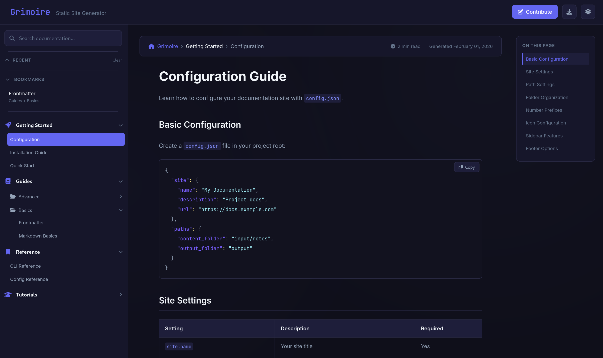
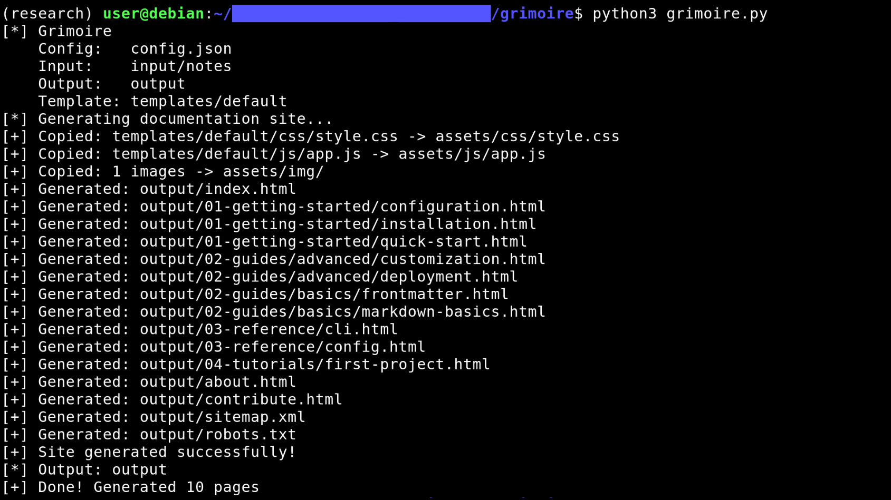

# 📖 Grimoire

A lightweight static site generator that converts Markdown files into beautiful documentation websites.

**Repository:** https://github.com/TristanInSec/Grimoire

**Live Demo:** https://tristaninsec.github.io/Grimoire/ — this documentation site is itself generated by Grimoire

**Live Example:** [HackWiki](https://hackwiki.com) — 300+ page cybersecurity knowledge base built with Grimoire and a [custom template](https://github.com/hack-wiki/hackwiki-template)

**Screenshot:**



## Features

- **Hierarchical Navigation** - Unlimited folder depth with collapsible sections
- **YAML Frontmatter** - Page metadata (title, date, description, custom fields)
- **Smart Display Names** - Number prefix stripping, acronym capitalization, configurable lowercase words
- **AJAX Navigation** - Smooth page transitions with browser history support
- **Full-Text Search** - Real-time search with highlighting
- **Auto Table of Contents** - Per-page TOC with scroll-aware highlighting
- **Bookmarks & Recent** - Persistent via localStorage
- **Dark/Light Theme** - Toggle with automatic persistence
- **Mobile Responsive** - Slide-out navigation on mobile
- **Syntax Highlighting** - Prism.js with extensible language support
- **SEO Ready** - Meta tags, sitemap, robots.txt, JSON-LD structured data
- **Automatic Breadcrumbs** - Generated from folder hierarchy
- **FontAwesome Icons** - Configurable per category
- **Configurable Navigation** - Pin pages to top, custom sort order via number prefixes
- **HTML Export** - Export individual pages as standalone HTML
- **Shared Data Optimization** - Site config, page metadata, and navigation cached in a single JS file instead of embedded per page (92% size reduction on large sites)

## Quick Start

### 1. Install Dependencies

```bash
pip install markdown pyyaml
```

### 2. Configure

Edit `config.json` for your site:

```json
{
  "site": {
    "name": "My Docs",
    "description": "Documentation for my project",
    "url": "https://docs.example.com"
  },
  "paths": {
    "content_folder": "input/notes",
    "output_folder": "output"
  }
}
```

### 3. Add Content

Create Markdown files in `input/notes/`:

```
input/notes/
├── 01-getting-started/
│   ├── installation.md
│   └── configuration.md
├── 02-guides/
│   ├── basics/
│   │   └── quickstart.md
│   └── advanced/
│       └── customization.md
└── 03-reference/
    └── api.md
```

### 4. Build

```bash
python3 grimoire.py
```



### 5. Preview

```bash
cd output && python3 -m http.server 8000
# Visit http://localhost:8000
```

## Project Structure

```
grimoire/
├── grimoire.py             # Generator script
├── config.json             # Site configuration
├── templates/
│   └── default/            # Built-in purple/indigo theme
│       ├── template.html
│       ├── css/style.css
│       ├── js/app.js
│       └── img/
├── input/
│   ├── notes/              # Your markdown content
│   └── pages/              # Static pages (about, etc.)
└── output/                 # Generated site (gitignored)
```

## Configuration Reference

### Site

| Key | Type | Description |
|-----|------|-------------|
| `site.name` | string | Site title in header |
| `site.description` | string | Tagline under title |
| `site.url` | string | Base URL for sitemap and canonical links |
| `site.github_url` | string | GitHub link in header |

### Paths

| Key | Default | Description |
|-----|---------|-------------|
| `paths.content_folder` | `input/notes` | Markdown source directory |
| `paths.pages_folder` | `input/pages` | Static pages directory |
| `paths.output_folder` | `output` | Generated site output |
| `paths.template_folder` | `templates/default` | Template directory |
| `paths.exclusions` | `[".trash", ".obsidian", ".git", ...]` | Files and folders to skip during processing |

> **Note:** `exclusions` matches against all path components — both folder names and filenames. Legacy key `exclude_folders` is still supported.

### SEO

| Key | Type | Description |
|-----|------|-------------|
| `seo.index_description` | string | Meta description for homepage (use `{site_name}`) |
| `seo.page_description_template` | string | Template for page descriptions (use `{title}`, `{category}`, `{site_name}`) |
| `seo.keywords` | string | Meta keywords for all pages |

### Generator

| Key | Default | Description |
|-----|---------|-------------|
| `generator.generate_sitemap` | `true` | Generate sitemap.xml |

### UI

```json
{
  "ui": {
    "show_recent": true,
    "show_bookmarks": true,
    "show_contribute": true,
    "contribute_text": "Contribute",
    "contribute_url": "./contribute.html",
    "strip_number_prefix": true,
    "pin_to_top": ["overview", "index"],
    "category_icons": {
      "guides": "fas fa-book",
      "reference": "fas fa-bookmark"
    },
    "default_icon": "fas fa-folder"
  }
}
```

| Key | Default | Description |
|-----|---------|-------------|
| `show_recent` | `true` | Show "Recent" section in sidebar |
| `show_bookmarks` | `true` | Show "Bookmarks" section in sidebar |
| `show_contribute` | `true` | Show contribute button in header and footer |
| `contribute_text` | `"Contribute"` | Button text |
| `contribute_url` | `"./contribute.html"` | Link URL |
| `strip_number_prefix` | `true` | Format names (strip prefixes, capitalize). Set `false` to keep names as-is |
| `pin_to_top` | `["overview", "index"]` | Filenames (without `.md`) to pin to the top of navigation. Order in the array = display order. Applies both within folders and at root level (pinned root pages appear above categories) |
| `category_icons` | `{}` | Map category names (after prefix stripping) to FontAwesome icons |
| `default_icon` | `"fas fa-folder"` | Fallback icon for unmapped categories |

### Formatting

```json
{
  "formatting": {
    "acronyms": ["api", "html", "css", "sql"],
    "display_name_overrides": {
      "tcp-ip": "TCP/IP",
      "ios": "iOS"
    },
    "lowercase_words": ["and", "or", "the", "a", "an", "in", "on", "at", "to", "for", "of", "with"]
  }
}
```

| Key | Default | Description |
|-----|---------|-------------|
| `acronyms` | `[]` | Words to uppercase in display names (e.g. `api` → `API`) |
| `display_name_overrides` | `{}` | Exact name → display name mappings (checked before and after prefix stripping) |
| `lowercase_words` | `[]` | Words to keep lowercase in display names unless they are the first word (e.g. `rules-of-engagement` → "Rules of Engagement"). If empty, all words are capitalized |

### Footer

| Key | Default | Description |
|-----|---------|-------------|
| `footer.show_copyright` | `true` | Show copyright notice |
| `footer.show_timestamp` | `true` | Show generation timestamp |
| `footer.show_powered_by` | `true` | Show "Powered by Grimoire" |
| `footer.copyright_text` | `""` | Custom copyright (use `{year}` and `{site_name}` placeholders) |

## Folder Naming & Sort Order

Number prefixes control **sort order** in navigation. By default, they are stripped from display names:

| Folder/File Name | Displays As | Sort Position |
|------------------|-------------|---------------|
| `01-overview.md` | Overview | 1st |
| `02-installation.md` | Installation | 2nd |
| `03-configuration.md` | Configuration | 3rd |
| `setup-guide.md` | Setup Guide | After numbered files |

Files without number prefixes sort alphabetically after numbered ones. To keep names exactly as-is (no formatting), set `ui.strip_number_prefix` to `false`.

## YAML Frontmatter

Optional metadata at the top of any `.md` file:

```markdown
---
display_name: Custom Page Title
last_update: 2025-01-30
description: Brief description for SEO
---

# Your Content Here
```

Alternative `%` format:

```markdown
% Display name: Custom Page Title
% Last update: 2025-01-30

# Your Content Here
```

| Field | Description |
|-------|-------------|
| `display_name` | Override the page title in navigation |
| `title` | Alternative to `display_name` |
| `last_update` | Date of last modification |
| `description` | SEO meta description (max 160 chars) |
| `icon` | FontAwesome icon class |

## Command Line

```bash
python3 grimoire.py                            # Use config.json defaults
python3 grimoire.py --template default         # Use default theme
python3 grimoire.py --input ./docs             # Override content path
python3 grimoire.py --output ./dist            # Override output path
python3 grimoire.py --config other.json        # Use different config
python3 grimoire.py --template /path/to/theme  # Custom template path
```

## Available Templates

| Template | Description |
|----------|-------------|
| `default` | Purple/indigo theme - clean, modern |

Custom templates can be installed into `templates/` and selected by name or path.

## CSS Customization

All theme variables are at the top of `templates/<theme>/css/style.css` in the **🎨 THEME CUSTOMIZATION** section:

```css
:root {
    /* Accent color - change to match your brand */
    --accent-primary: #6366f1;

    /* Content styling */
    --content-h1-size: 2.25rem;
    --content-h2-size: 1.5rem;
    --content-text-size: 1rem;
    --content-line-height: 1.7;
    --content-code-size: 0.875em;

    /* Navigation */
    --nav-category-size: 0.9rem;
    --nav-subcategory-size: 0.85rem;
    --nav-item-size: 0.8rem;

    /* Layout */
    --sidebar-width: 320px;
}
```

## Deployment

The `output/` folder is fully static. Deploy to GitHub Pages, Netlify, Vercel, AWS S3, or any web server.

## License

MIT
